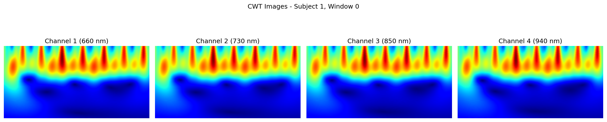

# ACNN-BiLSTM

### Unofficial PyTorch Implementation

> **ACNN-BiLSTM: A Deep Learning Approach for Continuous Noninvasive Blood Pressure Measurement Using Multi-Wavelength PPG Fusion**  
> Cui, M.; Dong, X.; Zhuang, Y.; Li, S.; Yin, S.; Chen, Z.; Liang, Y.  
> *Bioengineering* 2024, 11, 306.  
> [[Paper]](https://doi.org/10.3390/bioengineering11040306) [[Dataset]](https://doi.org/10.6084/m9.figshare.23283518.v1)

---

## Overview

This repository provides a clean, modular PyTorch implementation of the ACNN-BiLSTM model for **continuous noninvasive blood pressure (BP) prediction** from multi-wavelength photoplethysmography (PPG) signals.

The model fuses four wavelengths of PPG (660 nm, 730 nm, 850 nm, 940 nm) into 12-channel CWT scalogram images, then processes them through an attention-based CNN followed by a bidirectional LSTM to predict systolic and diastolic blood pressure.

<p align="center">
  
  <br>
  <em>CWT scalograms from 4-wavelength PPG (logarithmic frequency scaling)</em>
</p>

## Architecture

```
Input: 4-wavelength PPG (660, 730, 850, 940 nm)
  │
  ├─ Bandpass filter (0.5–8 Hz, Butterworth 2nd-order)
  ├─ Z-score normalization (per subject, per channel)
  ├─ Sliding window (5s window, 1s stride)
  ├─ CWT (cgau1 wavelet, 128 log-spaced scales) → jet colormap → RGB
  └─ 4 × RGB stacked → 12-channel image (128 × 256)
         │
         ▼
┌─────────────────────────────────────────────────────┐
│  Conv2D (12→32, 3×3) + ReLU + BatchNorm            │
│                                                     │
│  7 × ACNN Block:                                    │
│    Conv2D + ReLU + BatchNorm + SE Attention          │
│    Channels: 32→32→32→64→64→128→128→256             │
│    Strides:  [2, 1, 2, 1, 2, 2, 2]                 │
│                                                     │
│  Reshape → (batch, 8, 1024)                         │
│                                                     │
│  2 × BiLSTM (hidden=256, bidirectional)             │
│                                                     │
│  FC(512→128) + Dropout(0.2)                         │
│  FC(128→2)   + Dropout(0.2)                         │
└─────────────────────────────────────────────────────┘
         │
         ▼
Output: [SBP, DBP] (mmHg)
```

## Installation

```bash
git clone https://github.com/<your-username>/acnn-bilstm-bp.git
cd acnn-bilstm-bp
pip install -r requirements.txt
```

**Requirements:** Python 3.10+, PyTorch 2.4+, NumPy, SciPy, scikit-learn, PyWavelets, Pillow, matplotlib, pandas, openpyxl.

## Dataset

Download the dataset from [Figshare](https://doi.org/10.6084/m9.figshare.23283518.v1) and place it as:

```
Bioengineering_Paper_project_data/
├── data/
│   ├── 1.csv        # Subject 1: 4-channel PPG (12000 samples × 4 channels)
│   ├── 2.csv
│   └── ...180.csv
└── labels/
    └── Subjects Information.xlsx   # ID, SBP(mmHg), DBP(mmHg)
```

Each CSV contains ~60 seconds of 4-channel PPG sampled at 200 Hz (12000 samples).

## Signal Analysis & Discarded Subjects

The paper states that **180 subjects** were collected but only **162 subjects** were used for training/evaluation. The authors do not specify which 18 subjects were discarded or the criteria for exclusion.

We provide a visualization notebook ([`visualize_signals.ipynb`](visualize_signals.ipynb)) that plots raw and bandpass-filtered PPG signals for all 180 subjects to **identify the 18 discarded subjects** through visual inspection of signal quality (e.g., flat signals, excessive noise, motion artifacts, clipping).

<p align="center">
  
  <br>
  <em>Raw PPG signals — all 180 subjects (first 5 seconds)</em>
</p>

<p align="center">
  
  <br>
  <em>Bandpass-filtered PPG signals (0.5–8 Hz) — all 180 subjects</em>
</p>

<p align="center">
  
  <br>
  <em>Side-by-side comparison: raw vs. filtered for all subjects</em>
</p>

The notebook also saves per-subject plots to `outputs/images/` for detailed inspection:
- `raw_signals/subject_001.png` … `subject_180.png`
- `filtered_signals/subject_001.png` … `subject_180.png`
- `comparison_raw_vs_filtered/subject_001.png` … `subject_180.png`
- `full_signal_detail/subject_001.png` … `subject_180.png`

## Usage

### Train

```bash
# Full pipeline (with 10-fold cross-validation)
python -m acnn_bilstm.train

# Skip CV for faster iteration
python -m acnn_bilstm.train --no-cv

# Custom hyperparameters
python -m acnn_bilstm.train --no-cv --epochs 300 --batch-size 16 --lr 0.0005

# Compare with linear CWT scales (original paper approach)
python -m acnn_bilstm.train --no-cv --scale-type linear
```

### Evaluate

```bash
python -m acnn_bilstm.evaluate --checkpoint outputs/checkpoints/best_model.pth
```

### Outputs

All plots are saved to `outputs/images/`:
- `cwt_sample.png` — CWT scalogram visualization (4 wavelengths)
- `training_curves.png` — Train/val MAE over epochs
- `bland_altman_sbp.png` — Bland-Altman plot for SBP
- `bland_altman_dbp.png` — Bland-Altman plot for DBP

Model checkpoints saved to `outputs/checkpoints/`.

## Project Structure

```
acnn_bilstm/
├── config.py                # All hyperparameters (dataclass)
├── train.py                 # Training entry point
├── evaluate.py              # Evaluation entry point
├── data/
│   ├── loader.py            # CSV + Excel loading
│   ├── preprocessing.py     # Bandpass filter, Z-score, windowing
│   ├── cwt_transform.py     # CWT, colormap, 12-channel fusion
│   └── dataset.py           # PyTorch Dataset, subject-level splits
├── model/
│   ├── attention.py         # Squeeze-and-Excitation (SE) block
│   ├── acnn_block.py        # Conv2D + ReLU + BN + SE
│   └── acnn_bilstm.py       # Full model (~4.9M parameters)
├── training/
│   ├── trainer.py           # Training loop + early stopping
│   └── cross_validation.py  # 10-fold subject-level CV
└── evaluation/
    ├── metrics.py           # R², ME±SD, MAE, RMSE, AAMI, BHS
    └── plots.py             # Bland-Altman, loss curves
```

## Implementation Details

### What's specified in the paper

| Parameter | Value | Source |
|-----------|-------|--------|
| Sampling rate | 200 Hz | Section 2.1 |
| Bandpass filter | 0.5–8 Hz, Butterworth 2nd-order | Section 2.2 |
| Wavelet | cgau1 | Section 2.2 |
| Window | 5 s, stride 1 s | Section 2.2 |
| Model | ACNN-BiLSTM with 7 ACNN blocks, 2 BiLSTM layers | Figure 3 |
| Optimizer | Adam, lr=0.001 | Section 3.3 |
| Loss | MAE (L1) | Section 3.3 |
| Split | 80/20 subject-level | Section 3.3 |
| CV | 10-fold on training set | Section 3.3 |

### What's inferred (not specified in the paper)

| Parameter | Value | Reasoning |
|-----------|-------|-----------|
| CWT scales | 128, **log-spaced** (25–400) | Covers the full 0.5–8 Hz band; linear 1–128 misses the fundamental HR frequency (<1.56 Hz) |
| Image size | 128 × 256 | 128 scales → height; 256 width preserves temporal morphology; after 5 stride-2 ops → 4×8, clean BiLSTM input |
| SE reduction | 16 | Standard from Hu et al. 2018 (SE-Net paper) |
| Stride pattern | [2,1,2,1,2,2,2] | 5 stride-2 ops reduce 128×256 → 4×8; alternating allows feature consolidation |
| Channel progression | 32→32→32→64→64→128→128→256 | Doubles channels when spatial dims halve (standard CNN design) |
| BiLSTM hidden | 256 | Gives 512 output (bidirectional); compression ratio 1024:256 = 4:1 |
| Batch size | 32 | Balances GPU memory with gradient quality |
| Early stopping | Patience=150 | Paper trains long (500 epochs); generous patience avoids premature stopping |
| Dropout | 0.2 | Light regularization for the FC layers |

### Improvement: Logarithmic CWT Scales

This implementation uses **logarithmic frequency scaling** by default, which is an improvement over the paper's implied linear scales:

- **Linear scales (1–128):** Maps to 1.56–200 Hz. ~19% of scales land above 8 Hz (dead after bandpass filter). Cannot represent the fundamental heart rate (1–1.67 Hz at rest).
- **Log scales (25–400):** Maps to exactly 0.5–8 Hz. Equal resolution per octave. All physiologically relevant frequencies are captured.

Use `--scale-type linear` to reproduce the original paper's approach.

## Results

The paper reports (Trial 3, multi-wavelength fusion):

| Metric | SBP (mmHg) | DBP (mmHg) |
|--------|-----------|-----------|
| R² | 0.95 | 0.96 |
| ME ± SD | 0.22 ± 5.28 | 0.71 ± 2.43 |
| MAE | 1.67 | 1.15 |
| RMSE | 5.28 | 2.53 |
| AAMI | Yes | Yes |
| BHS Grade | A | A |

> **Note:** Results may vary from the paper due to differences in CWT scaling, random seeds, and implementation details not specified in the paper.

## Evaluation Metrics

- **R²** — Coefficient of determination
- **ME ± SD** — Mean error ± standard deviation
- **MAE** — Mean absolute error
- **RMSE** — Root mean squared error
- **AAMI** — Association for the Advancement of Medical Instrumentation (ME < ±5, SD < 8)
- **BHS** — British Hypertension Society grade (A/B/C/D based on cumulative error distribution)
- **Bland-Altman** — Agreement plot between predicted and true BP

## Citation

If you use this code, please cite the original paper:

```bibtex
@article{cui2024acnn,
  title     = {ACNN-BiLSTM: A Deep Learning Approach for Continuous Noninvasive Blood Pressure Measurement Using Multi-Wavelength PPG Fusion},
  author    = {Cui, Mou and Dong, Xuhao and Zhuang, Yan and Li, Shiyong and Yin, Shimin and Chen, Zhencheng and Liang, Yongbo},
  journal   = {Bioengineering},
  volume    = {11},
  number    = {4},
  pages     = {306},
  year      = {2024},
  publisher = {MDPI},
  doi       = {10.3390/bioengineering11040306}
}
```

## License

This is an unofficial implementation for research purposes. The original paper and dataset are the work of Cui et al. Please refer to the [original dataset license](https://doi.org/10.6084/m9.figshare.23283518.v1) for data usage terms.

## Acknowledgments

- Original authors for the paper and publicly available dataset
- [PyWavelets](https://pywavelets.readthedocs.io/) for CWT implementation
- [Hu et al. 2018](https://arxiv.org/abs/1709.01507) for the SE-Net attention mechanism
